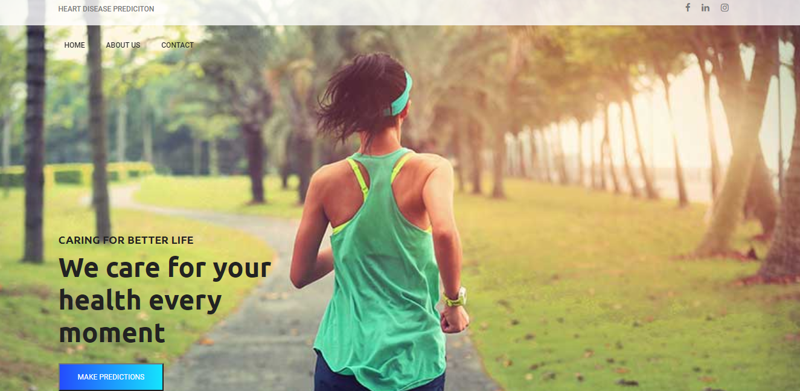

# Heart-Disease-Detection :Overview

Simple App which can detect Weather they have Heart Disease or not depending up on users data provided to the application.
* Created an app that detects wheather they have Heart Disease or not to help doctors with 85% accuracy .
* Data collected from Open source websites from Internet .
* Processed features to make data look's like perfect and to get good accuracy with less loss
* I had used Ada boost Classifier ,XGBoost ,Logistic ,support vector to reach best model
* Deployed model on Heroku .

## Code and Resources Used :
* Python Version : 3.7
* Packages: pandas, numpy, sklearn, matplotlib, seaborn, selenium, flask, json, pickle
* For Web Framework Requirements: `pip install -r requirements.txt`
* Languages : Python ,CSS ,Html ,Java Script

## Data Cleansing :
 Normally data place an key role in any every project ,if our data is noisy less data Thank it is good sign towards better model and good accuracy with less loss in any project .
## Model building :
 First, I transformed the categorical variables into dummy variables. I also split the data into train and tests sets with a test size of 20%.
I tried three different models and evaluated them using Classification Metrics. I chose Confusion Matrix Because it's better to understand how many features are going to support and not going to support .
I tried Five different models:

* Support Vector Classifier: It classifies data perfectly
* Logistic Regression
* K-Nearest Neighbour Classifier
* Naive Bayes Classifier
* XGBoost Classifier

## Productionization :
* In this step , I had deployed Model on heroku with Flask api.
* The API endpoint takes in a request with a values by end user and returns weather they have heart Disease or not . Here is URL to predict [Heart Diseasedetection Web App](https://heartdiseasesprediction.herokuapp.com/)

## References :

https://getbootstrap.com/  
https://flask.palletsprojects.com/en/1.1.x/   
https://html.spec.whatwg.org/   

https://theheartfoundation.org/reducing-your-risk/   

https://www.acls.net/effects-of-drugs.htm
